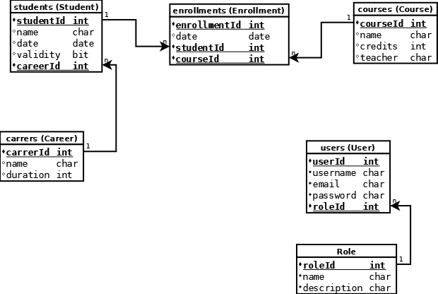

    
   <table id="vertical-1">
        <caption></caption>
        <tr>
            <th>NAME</th>
            <td>API Courses</td>
        </tr>
     <tr>
            <th>TYPE</th>
            <td>API</td>
        </tr>
        <tr>
            <th>SUMMARY</th>
            <td>Desarrollo de API REST para la gestión de cursos de un centro educativo. Esta API tiene fines de fortalecer conceptos en Python / Django REST FRAMEWORK. </td>
        </tr>
        <tr>
            <th>TECHNOLOGIES</th>
            <td>
             
            </td>
        </tr>
        <tr>
            <th>AUTH</th>
            <td>JSON Web Token</td>
        </tr>
        <tr>
            <th>LOCALHOST</th>
            <td><a href="http://localhost:8000/api/v1" target="_blank">http://localhost:8000/api/v1</a>
            </td>
        </tr>
   </table>

## Database | SQL
 
## Local Development
### Requerimients

Python
[https://www.python.org/downloads/](https://www.python.org/downloads/)

MySQL
[https://www.mysql.com/downloads/](https://www.mysql.com/downloads/)

### Git Repository
```
git clone https://github.com/migueldev81/django-courses
```
### Variables Enviroment (.env)
````
DB_DATABASE=
DB_USER=
DB_PASSWORD=
DB_HOST=
DB_PORT=
SECRET_KEY = 
````
### Create Database | SQL Console
````
CREATE DATABASE [DB_DATABASE];
````
### Virtual Enviroment
```
cd venv 
```
```
cd scripts>activate
```
```
pip install -r requirements.txt
```

### Start Project
```
python manage.py migrate
```
```
python manage.py runserver
```
